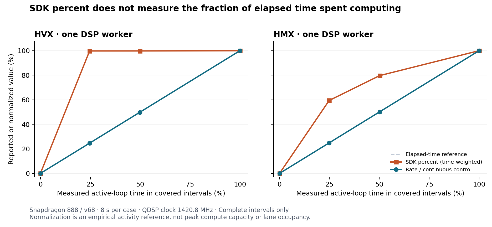
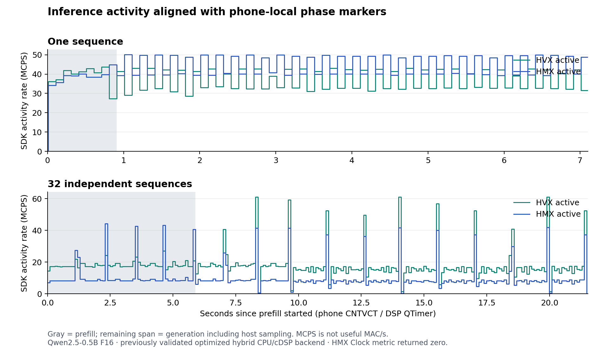

# Measuring HVX and HMX activity during phone-local inference

We can measure engine activity on this Snapdragon 888, but the SDK's fields named
“Utilization” are not general elapsed-time or compute-capacity percentages. Twelve
controlled workloads establish a usable activity reference. Two additional
inference captures use that reference and corrected phase timestamps. All
collection runs through the Python/C++ library on the phone.

The device is a rooted OnePlus 9 LE2115, SM8350, Android 14, Hexagon v68. The host
recorded this experiment on 2026-09-30; the phone's wall clock was different and
was not changed. Measurements use hardware counters rather than calendar time.

## A direct counterexample to interpreting the SDK percentage as elapsed time

The probe issues one RPC containing eight seconds of DSP-controlled computation
and sleeping, with a 250 ms period. Its independent QTimer records delimit every
active region. A continuous scalar loop is a negative control. HVX uses one
128-byte context; HMX repeatedly computes a resident 32 × 1024 × 32 FP16 product
using 256 KiB of VTCM. Inputs and resource acquisition precede the measurement
window. Every workload passes its output checks and releases its resources.

The following are duration-weighted results from complete sample intervals.
“Measured active region” is recomputed over those same covered intervals, so it
can differ slightly from the requested 25% or 50% duty. It includes loop and issue
overhead; it is not a direct instruction-issue occupancy measurement.

| Control | Measured active region, % | Active rate, MCPS | SDK percentage | Rate relative to continuous control, % |
| --- | ---: | ---: | ---: | ---: |
| HVX, requested 0% | 0.000 | 0.000 | 0.000 | 0.000 |
| HVX, requested 25% | 24.642 | 349.961 | 99.777 | 24.642 |
| HVX, requested 50% | 49.751 | 706.553 | 99.790 | 49.751 |
| HVX, requested 100% | 100.000 | 1420.187 | 99.957 | 100.000 |
| HMX, requested 0% | 0.000 | 0.000 | 0.000 | 0.000 |
| HMX, requested 25% | 24.849 | 353.095 | 59.409 | 24.852 |
| HMX, requested 50% | 50.176 | 712.935 | 79.684 | 50.178 |
| HMX, requested 100% | 100.000 | 1420.800 | 100.000 | 100.000 |

All four scalar controls report zero HVX and HMX activity inside their measured
windows. The QDSP Clock is 1420.8 MHz throughout every selected control interval.
The empirical normalized rates agree with independently measured active-region
fractions within 0.003 percentage points in these controls. This is a consistency
check on this device, decoder, clock and workload family, not a general accuracy
bound or proof of physical peak throughput.

## What the SDK computes

The inspected Android decoder divides the HMX active event count by the actual
measured interval to produce MCPS. The selected percentage path computes
`min(100, 100 × active_MCPS / QDSP6_Load_MCPS)`. QDSP6 Load itself is processor
cycles divided by measured time. The processor-cycle counter stops in low-power
states such as clock gating. It therefore is not the clock-cycle budget for all
elapsed time. Sleeping controls expose this distinction particularly clearly.

HVX has an additional decoder scaling path. On older architectures, the fallback
halves a rate above 1600 MCPS when its target factor is zero. Newer architectures
can provide an explicit scaling factor. The present controls and inference stay
below that threshold. These findings must not be generalized to multiple contexts
or other SDK/architecture versions without another calibration.

The installed SDK describes the HMX event as activity of MAC/convert/FIFO state.
Official v68-related HVX event documentation describes FIFO activity, but its
itrace event IDs are not raw PMU selectors. These are activity observations, not
counts of useful operations, active lanes or useful matrix rows. The HMX Clock
metric returns zero in every selected interval, so it provides no independent
HMX frequency measurement here.

## A timestamp conversion error that mattered for short phases

The installed `libQualcommProfilerApi.so` converts absolute QTimer ticks using
the binary64 literal **52.08333 ns/tick**, rather than the exact
`1,000,000,000 / 19,200,000`. Its `qtimer_convertTicksToNs` function converts ticks
to double, multiplies, then truncates to uint64. Direct disassembly establishes
the arithmetic. The library SHA-256 is
`bb37729aaf6c54f0dc5207d5d14430a3224b7127c67a665ddd24ab325946fb57`.

That small scale error accumulates with uptime. At this phone's uptime, raw SDK
timestamps are about **134.7 ms early** relative to the directly read hardware
counter. A broad “timestamp falls within the capture” check would miss it.
Such an offset materially affects approximately 200 ms single-sequence decode
calls.

The research analyzer retains the raw SDK timestamp, recovers the nearest tick
using the verified conversion coefficient, and converts ticks at exactly
19.2 MHz. Across all **1,301 packets from 15 captures**, recovered adjacent tick
differences exactly match the original `systick_diff`; reconstruction of the raw
SDK timestamp differs by at most 0.75 ns. DSP-internal QTimer records and host
CNTVCT edges provide an additional cross-check. Correcting the timestamps also
removes the discrepancy between controlled duty and measured counter activity.

This correction is specific to the verified SDK binary. It is not silently
applied to arbitrary `qcphoneperf` timestamps. The API exposes declared timestamp
metadata separately and preserves the original integer value.

## Phase-aligned inference results

The same optimized hybrid CPU/cDSP backend from the
[previous inference experiments](UTILIZATION.md) runs Qwen2.5-0.5B F16. Only the
experimental caller adds CNTVCT markers around prefill, generation and individual
decode calls. Generation includes host-side sampling between decode calls.

| Generation workload | Covered time | HVX activity, MCPS | HMX activity, MCPS | HVX relative to continuous control | HMX relative to continuous control |
| --- | ---: | ---: | ---: | ---: | ---: |
| One sequence, 32 output tokens | 98.37% | 37.175 | 44.600 | 2.62% | 3.14% |
| 32 independent sequences, 12 tokens each | 99.52% | 18.113 | 9.891 | 1.28% | 0.70% |

These percentages mean activity relative to the respective sustained control at
the same QDSP clock. They are not percentages of peak useful MAC/s. The 32-stream
case still has higher aggregate decode throughput: 23.40 versus 5.11 input
tokens/s. Activity and useful work efficiency are different observations; raising
an activity counter alone is not an optimization objective.

Complete-interval coverage of prefill is 88.60% for one sequence and 97.21% for
32 sequences. The union of individual decode calls has 51.08% and 92.41% coverage,
respectively. Many roughly 100 ms samples cross the boundaries of short calls.
Those crossing samples are excluded, not divided or assigned by guesswork.
The generation-window values above therefore provide the better-covered
comparison; the data also retains the separate decode-call summaries.

## Reusing the method

1. Collect the seven metric IDs and preserve raw values and parameters through
   `qcphoneperf.Profiler.snapshot_metrics()`, entirely on the phone.
2. Read the matching SDK parameter schema. In this verified schema, parameter 6
   is the 19.2 MHz tick delta, 7 is measured milliseconds, 8 is the metric count,
   and 9 is the DSP packet type. Requested sampling period is not measured time.
3. Verify the timestamp decoder and hardware-clock relationship. Preserve raw
   timestamps and identify any correction by binary hash.
4. Mark workload phases using the phone hardware counter. Integrate complete,
   valid intervals inside each phase and report the covered fraction. Include
   zero activity. Compute `sum(rate × interval) / sum(interval)`.
5. Compare against isolated controls at the same observed clock and document
   event semantics. Repeat calibration when hardware, SDK, precision, context
   configuration or relevant clock behavior changes.

The idle clock control requested a 100 ms period but returned approximately
503–516 ms intervals. Active controls often returned approximately 100 ms
intervals. Neither receipt timestamps nor requested cadence can replace the
actual measured intervals. Packet-type numeric enums remain unverified; the
analyzer does not invent meanings for them.

The [probe and capture source](../experiments/load-calibration/README.md) and
[compact measured evidence](../results/LOAD-CALIBRATION-20260930.json) are available
for reproduction. Python analysis functions can be imported directly; they do
not require a desktop service, collector CLI or APK. A development computer was
used only to compile, stage and retrieve these experiments. The installed SDK and
original profiler service were preserved.

## What remains unresolved

These measurements distinguish no activity, intermittent activity and sustained
activity, and locate activity within inference phases. They do not identify how
many of a padded 32-row tile contain useful work. Record logical matrix shapes,
padding and valid output rows alongside counters to study that question.

Separately measuring MAC, conversion, FIFO stalls, useful operation counts and
all-context saturation would require validated event support and additional
controls. The SDK contains raw-PMU/roofline definitions, but their advertised
presence does not establish acceptance or correct semantics on this v68 phone.
No raw MAC-cycle or TOPS measurement is claimed here.
